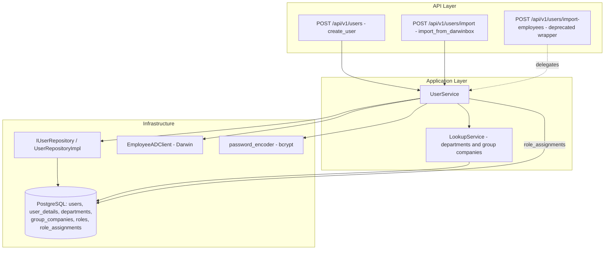
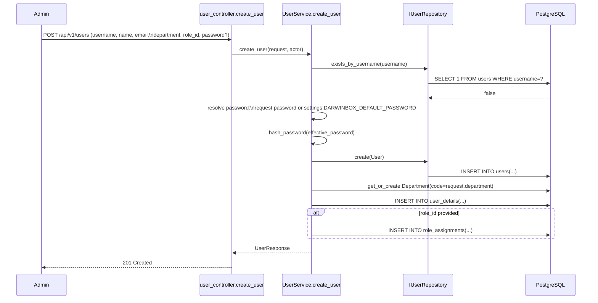
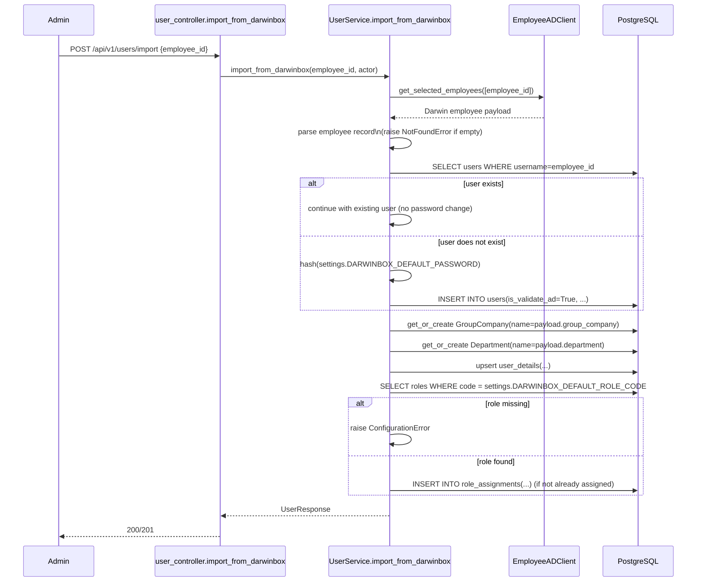

# Design Document: User Provisioning (Manual Creation + Darwinbox Import)

## Overview

This feature builds the missing user-provisioning layer for the VLR backend: the ability to create a fully-profiled user manually, and the ability to import a user from Darwinbox/AD by employee ID. Today, `POST /api/v1/users/` only writes to `users` (auth fields) and ignores profile data entirely, and the ad-hoc `POST /api/v1/users/import-employees` endpoint is broken (it references a nonexistent `role` column on `UserModel` and never assigns RBAC roles or creates lookup rows for department/group company).

The design fixes both flows under `UserService`, introduces `departments` and `group_companies` as first-class lookup tables (auto-created on demand), and wires a `DARWINBOX_DEFAULT_PASSWORD` setting used as the password fallback for both manual creation and Darwinbox-imported accounts. Login (`/api/v1/auth/login`) and SSO are unaffected — this feature is purely about getting users *into* the system correctly.

**Design decisions made during investigation** (called out explicitly since the codebase gave no precedent):
- **Default "User" role**: no role literally named `User` exists in `seed_rbac.py` (closest is `Reconciliation_User`). Rather than hardcode a role name that may not exist (the same class of bug as the current `role="USER"` column bug), the target role code is read from a new setting `DARWINBOX_DEFAULT_ROLE_CODE` (default `"Reconciliation_User"`). If the role code doesn't resolve to a row, import fails loudly instead of silently skipping RBAC assignment.
- **Legacy `/users/import-employees` endpoint**: kept as a thin, backward-compatible wrapper that delegates to the fixed `UserService.import_from_darwinbox`, marked deprecated in OpenAPI. The new canonical endpoint is `POST /api/v1/users/import`. Removing the old route outright would break any existing caller with no migration path, so deprecation-in-place is safer; it can be deleted in a later cleanup once confirmed unused.

## Architecture



## Sequence Diagrams

### Manual Creation



### Darwinbox Import



## Components and Interfaces

### Component 1: UserService (extended)

**Purpose**: Orchestrates manual user creation and Darwinbox import, including profile persistence, lookup-row auto-creation, and RBAC role assignment.

**Interface**:
```python
class UserService:
    async def create_user(self, request: CreateUserRequest, actor: User) -> UserResponse: ...
    async def import_from_darwinbox(self, request: ImportFromDarwinboxRequest, actor: User) -> UserResponse: ...

    # New private collaborators
    async def _resolve_password_hash(self, explicit_password: str | None) -> str: ...
    async def _get_or_create_department(self, name: str) -> "DepartmentModel": ...
    async def _get_or_create_group_company(self, name: str) -> "GroupCompanyModel": ...
    async def _assign_default_role(self, user_id: UUID, actor_username: str) -> None: ...
```

**Responsibilities**:
- Validate uniqueness of `username` before create.
- Resolve the effective password (explicit vs. `DARWINBOX_DEFAULT_PASSWORD`) and hash it.
- Persist `user_details` (full profile) alongside `users` in the same DB transaction.
- Auto-create `departments` / `group_companies` rows when the incoming name doesn't match an existing row (case-insensitive match on `name`).
- Assign RBAC role via `role_assignments` (never write a `role` column — it doesn't exist on `UserModel`).

### Component 2: EmployeeADClient (existing, unchanged)

**Purpose**: Talks to Darwin's `/getselectedemployees`. No changes needed — `UserService.import_from_darwinbox` becomes the only caller of business logic; the ad-hoc parsing currently living in `employee_import_controller.py` moves into `UserService`.

### Component 3: LookupService helpers (new, inside UserService or a small `LookupRepository`)

**Purpose**: `get_or_create`-style helpers for `departments` and `group_companies`, keeping user_details free-text columns for backward-compatible display while adding normalized FK references.

**Interface**:
```python
class DepartmentModel(BaseModel):
    __tablename__ = "departments"
    name: Mapped[str]          # unique, case-insensitive via functional index
    is_active: Mapped[bool]

class GroupCompanyModel(BaseModel):
    __tablename__ = "group_companies"
    name: Mapped[str]          # unique, case-insensitive via functional index
    is_active: Mapped[bool]
```

## Data Models

### Updated: `CreateUserRequest`

```python
class CreateUserRequest(BaseModel):
    username: str = Field(..., min_length=3, max_length=255)
    password: str | None = Field(
        default=None, min_length=8, max_length=128,
        description="If omitted, falls back to settings.DARWINBOX_DEFAULT_PASSWORD",
    )
    is_validate_ad: bool = Field(default=True)
    role_id: UUID | None = None

    # Profile fields (write into user_details)
    name: str = Field(..., min_length=1, max_length=255)
    email: EmailStr
    department: str = Field(..., min_length=1, max_length=255)
    designation_title: str = Field(default="")
    reporting_manager: str = Field(default="")
    employee_id: str | None = Field(
        default=None, description="Defaults to username when omitted"
    )
```

**Validation Rules**:
- `password` is optional now (was required); when `None`, the service falls back to `DARWINBOX_DEFAULT_PASSWORD`.
- `email` must be a valid email (new `EmailStr` — was entirely absent from the request before).
- `department` is required text; service resolves/creates the matching `DepartmentModel` row.

### New: `ImportFromDarwinboxRequest`

```python
class ImportFromDarwinboxRequest(BaseModel):
    employee_id: str = Field(..., min_length=1, max_length=50)
```

### Updated: `UserDetailsModel` / `user_details` table

Adds two nullable FK columns while keeping the existing free-text `department` / `group_company` string columns untouched for backward compatibility with existing reads/reports:

```python
department_id: Mapped[str | None] = mapped_column(
    UUID(as_uuid=True), ForeignKey("departments.id", ondelete="SET NULL"), nullable=True,
)
group_company_id: Mapped[str | None] = mapped_column(
    UUID(as_uuid=True), ForeignKey("group_companies.id", ondelete="SET NULL"), nullable=True,
)
```

**Validation Rules**:
- `department_id` / `group_company_id` are populated by `_get_or_create_department` / `_get_or_create_group_company`; the string columns (`department`, `group_company`) are still written for display/reporting continuity.

### New Settings (`src/config/settings.py`)

```python
DARWINBOX_DEFAULT_PASSWORD: str = Field(
    default="", description="Fallback password for manual/Darwinbox-created users when none is supplied",
)
DARWINBOX_DEFAULT_ROLE_CODE: str = Field(
    default="Reconciliation_User", description="Role code auto-assigned on Darwinbox import",
)
```

**Validation Rules**:
- `UserService` raises a `ConfigurationError` at call time (not at import time) if `DARWINBOX_DEFAULT_PASSWORD` is empty and no explicit password was supplied — this fails loudly instead of hashing an empty string.
- This value must be added to `.env` / `.env.example` and treated as a secret (not logged, not returned in any response).

## Algorithmic Pseudocode

### Function: `UserService.create_user`

```python
async def create_user(self, request: CreateUserRequest, actor: User) -> UserResponse:
    """
    PRECONDITIONS:
      - request.username is unique (checked below)
      - request.email is a syntactically valid email
      - request.role_id, if provided, references an existing active role
      - actor is an authenticated, active user with users.CREATE permission

    POSTCONDITIONS:
      - Exactly one row exists in `users` with username == request.username
      - Exactly one row exists in `user_details` with user_id == new user's id
      - If request.role_id set: exactly one active row_assignments row for (user, role)
      - Returned password_hash is never included in UserResponse

    LOOP INVARIANT: N/A (no per-item loops in this function)
    """
    if await self._user_repo.exists_by_username(request.username):
        raise ValueError(f"Username '{request.username}' already exists")

    password_hash = await self._resolve_password_hash(request.password)

    user = User(
        id=uuid4(),
        username=request.username,
        password_hash=password_hash,
        is_validate_ad=request.is_validate_ad,
        created_by=actor.username,
        modified_by=actor.username,
    )
    created = await self._user_repo.create(user)

    department = await self._get_or_create_department(request.department)

    details = UserDetailsModel(
        id=uuid4(),
        user_id=created.id,
        employee_id=request.employee_id or request.username,
        employee_name=request.name,
        email=str(request.email),
        designation_title=request.designation_title,
        department=request.department,          # free-text, unchanged
        department_id=department.id,              # new FK
        reporting_manager=request.reporting_manager,
        created_by=actor.username,
        modified_by=actor.username,
    )
    self._session.add(details)

    if request.role_id:
        await self._assign_role(created.id, request.role_id, actor.username)

    await self._session.flush()
    return self._to_response(created)
```

### Function: `UserService.import_from_darwinbox`

```python
async def import_from_darwinbox(
    self, request: ImportFromDarwinboxRequest, actor: User
) -> UserResponse:
    """
    PRECONDITIONS:
      - request.employee_id is non-empty
      - settings.DARWINBOX_DEFAULT_ROLE_CODE resolves to an existing active role
        (checked before any writes — fail fast, no partial state)
      - Darwin's /getselectedemployees is reachable (EmployeeADUnavailableError propagates as 502)

    POSTCONDITIONS:
      - A `users` row exists with username == employee_id and is_validate_ad == True
      - A `user_details` row exists for that user, populated from Darwin's response
      - `departments` / `group_companies` rows exist for the employee's department/group
        company (created if they didn't already exist — idempotent, no duplicates on re-import)
      - The default role (DARWINBOX_DEFAULT_ROLE_CODE) is assigned exactly once
        (re-running import for the same employee does not create a duplicate assignment)
      - If the user already existed, its password_hash is left untouched

    LOOP INVARIANT: N/A (single employee per call — batch import is out of scope,
      matching the ImportFromDarwinboxRequest shape of one employee_id per call)
    """
    default_role = await self._get_role_by_code(settings.DARWINBOX_DEFAULT_ROLE_CODE)
    if default_role is None:
        raise ConfigurationError(
            f"Default import role '{settings.DARWINBOX_DEFAULT_ROLE_CODE}' not found"
        )

    darwin_response = await self._ad_client.get_selected_employees([request.employee_id])
    employee_data = self._extract_single_employee(darwin_response, request.employee_id)
    if employee_data is None:
        raise ValueError(f"Employee '{request.employee_id}' not found in Darwinbox")

    existing = await self._user_repo.get_by_username(request.employee_id)

    if existing is None:
        password_hash = await self._resolve_password_hash(explicit_password=None)
        user = User(
            id=uuid4(),
            username=request.employee_id,
            password_hash=password_hash,
            is_validate_ad=True,
            created_by=actor.username,
            modified_by=actor.username,
        )
        user = await self._user_repo.create(user)
    else:
        user = existing  # password untouched

    department = await self._get_or_create_department(employee_data.get("department", ""))
    group_company = await self._get_or_create_group_company(employee_data.get("group_company", ""))

    await self._upsert_user_details(
        user_id=user.id,
        employee_data=employee_data,
        department_id=department.id,
        group_company_id=group_company.id,
        actor_username=actor.username,
    )

    await self._ensure_role_assigned(user.id, default_role.id, actor.username)

    await self._session.flush()
    return self._to_response(user)
```

### Helper: `_get_or_create_department` (idempotency detail)

```python
async def _get_or_create_department(self, name: str) -> DepartmentModel:
    """
    PRECONDITIONS: name may be empty string (Darwin data can be sparse)
    POSTCONDITIONS:
      - Returns a DepartmentModel row whose name matches `name` case-insensitively
      - Never creates two rows for names differing only by case
      - If name == "", returns/creates a sentinel "Unspecified" row rather than
        creating a row per empty string
    """
    normalized = name.strip() or "Unspecified"
    stmt = select(DepartmentModel).where(func.lower(DepartmentModel.name) == normalized.lower())
    result = await self._session.execute(stmt)
    dept = result.scalar_one_or_none()
    if dept is None:
        dept = DepartmentModel(id=uuid4(), name=normalized, is_active=True)
        self._session.add(dept)
        await self._session.flush()
    return dept
```

## Example Usage

```python
# Manual creation
request = CreateUserRequest(
    username="EMP1023",
    password=None,                      # falls back to DARWINBOX_DEFAULT_PASSWORD
    name="Priya Sharma",
    email="priya.sharma@example.com",
    department="Finance",
    designation_title="Senior Analyst",
    role_id=UUID("11111111-1111-1111-1111-111111111111"),
)
response = await user_service.create_user(request, actor=admin_user)

# Darwinbox import
import_request = ImportFromDarwinboxRequest(employee_id="EMP1023")
response = await user_service.import_from_darwinbox(import_request, actor=admin_user)
```

## Correctness Properties

### Property 1: Unique username always yields exactly one user + one profile row (Req 1.1)

**Validates: Requirements 1.1**

```python
assert not await user_repo.exists_by_username(request.username)  # before
created = await user_service.create_user(request, actor)
assert await user_repo.exists_by_username(request.username)
assert await count_user_details(created.id) == 1
```

### Property 2: Duplicate username is always rejected with zero mutation (Req 1.2)

**Validates: Requirements 1.2**

```python
existing_username = existing_user.username
before_count = await count_all_users()
with pytest.raises(ValueError):
    await user_service.create_user(request_with(existing_username), actor)
assert await count_all_users() == before_count
```

### Property 3: Omitting password always falls back to DARWINBOX_DEFAULT_PASSWORD (Req 1.3)

**Validates: Requirements 1.3**

```python
request = create_user_request(password=None)
created = await user_service.create_user(request, actor)
assert verify_password(settings.DARWINBOX_DEFAULT_PASSWORD, created.password_hash)
```

### Property 4: An explicit password is always used verbatim (Req 1.4)

**Validates: Requirements 1.4**

```python
request = create_user_request(password=explicit_password)
created = await user_service.create_user(request, actor)
assert verify_password(explicit_password, created.password_hash)
```

### Property 5: Missing password + unset default always rejects with zero writes (Req 1.5)

**Validates: Requirements 1.5**

```python
settings.DARWINBOX_DEFAULT_PASSWORD = ""
before_count = await count_all_users()
with pytest.raises(ConfigurationError):
    await user_service.create_user(create_user_request(password=None), actor)
assert await count_all_users() == before_count
```

### Property 6: Profile fields always round-trip exactly what was submitted (Req 1.6)

**Validates: Requirements 1.6**

```python
request = create_user_request(name=..., email=..., department=..., designation_title=..., reporting_manager=...)
created = await user_service.create_user(request, actor)
details = await get_user_details(created.id)
assert details.employee_name == request.name
assert details.email == str(request.email)
assert details.designation_title == request.designation_title
assert details.reporting_manager == request.reporting_manager
```

### Property 7: A valid active role_id always yields exactly one active role assignment (Req 1.8)

**Validates: Requirements 1.8**

```python
request = create_user_request(role_id=valid_active_role.id)
created = await user_service.create_user(request, actor)
assert await count_active_role_assignments(created.id, valid_active_role.id) == 1
```

### Property 8: An invalid/inactive role_id always rejects the request with no user created (Req 1.9)

**Validates: Requirements 1.9**

```python
before_count = await count_all_users()
with pytest.raises(ValueError):
    await user_service.create_user(create_user_request(role_id=invalid_role_id), actor)
assert await count_all_users() == before_count
```

### Property 9: Department lookup is case/whitespace-insensitive and never duplicates rows (Req 1.10)

**Validates: Requirements 1.10**

```python
d1 = await user_service._get_or_create_department("Finance")
d2 = await user_service._get_or_create_department("  finance ")
d3 = await user_service._get_or_create_department("FINANCE")
assert d1.id == d2.id == d3.id
```

### Property 10: The response never carries password_hash or plaintext password (Req 1.11, Req 4.3)

**Validates: Requirements 1.11, 4.3**

```python
response = await user_service.create_user(request, actor)
assert not hasattr(response, "password_hash")
assert not hasattr(response, "password")
```

### Property 11: Unknown employee_id always yields a 404-mapped error with zero rows created (Req 2.2)

**Validates: Requirements 2.2**

```python
before_count = await count_all_users()
with pytest.raises(ValueError):
    await user_service.import_from_darwinbox(ImportFromDarwinboxRequest(employee_id=unknown_id), actor)
assert await count_all_users() == before_count
```

### Property 12: A brand-new employee_id always creates an AD-validated user with the default password hash (Req 2.5)

**Validates: Requirements 2.5**

```python
result = await user_service.import_from_darwinbox(ImportFromDarwinboxRequest(employee_id=new_id), actor)
user = await user_repo.get_by_id(result.id)
assert user.is_validate_ad is True
assert verify_password(settings.DARWINBOX_DEFAULT_PASSWORD, user.password_hash)
```

### Property 13: Import never changes an existing user's password_hash (Req 2.6)

**Validates: Requirements 2.6**

```python
existing_hash = existing_user.password_hash
await user_service.import_from_darwinbox(ImportFromDarwinboxRequest(employee_id=existing_user.username), actor)
assert (await user_repo.get_by_id(existing_user.id)).password_hash == existing_hash
```

### Property 14: Malformed department/group_company data always fails the entire import with zero writes (Req 2.7)

**Validates: Requirements 2.9**

```python
before_count = await count_all_users()
with pytest.raises((ValueError, TypeError)):
    await user_service.import_from_darwinbox(ImportFromDarwinboxRequest(employee_id=malformed_payload_id), actor)
assert await count_all_users() == before_count
```

### Property 15: Repeated imports of the same employee_id never duplicate the user_details row (Req 2.8, Req 2.12)

**Validates: Requirements 2.10, 2.12**

```python
for _ in range(random_repeat_count):
    await user_service.import_from_darwinbox(ImportFromDarwinboxRequest(employee_id=emp_id), actor)
assert await count_user_details_for_username(emp_id) == 1
```

### Property 16: Repeated imports never duplicate role assignment, department, or group company rows (Req 2.9, Req 2.10, Req 2.12)

**Validates: Requirements 2.11, 2.12**

```python
for _ in range(random_repeat_count):
    await user_service.import_from_darwinbox(ImportFromDarwinboxRequest(employee_id=emp_id), actor)
assert await count_active_role_assignments(user.id, default_role.id) == 1
assert await count_departments_by_name(dept_name) == 1
assert await count_group_companies_by_name(company_name) == 1
```

## Error Handling

### Error Scenario 1: Username already exists (manual create)

**Condition**: `request.username` already present in `users`.
**Response**: `UserService.create_user` raises `ValueError`; controller maps to `409 Conflict`.
**Recovery**: Admin picks a different username or uses `PATCH /api/v1/users/{id}` to update the existing record instead.

### Error Scenario 2: `DARWINBOX_DEFAULT_PASSWORD` unset and no explicit password given

**Condition**: `request.password is None` and `settings.DARWINBOX_DEFAULT_PASSWORD == ""`.
**Response**: Raise `ConfigurationError` → controller maps to `500 Internal Server Error` with a message directing the operator to set the env var (never silently hash an empty string).
**Recovery**: Ops sets `DARWINBOX_DEFAULT_PASSWORD` in `.env` and restarts the service.

### Error Scenario 3: Default import role code doesn't resolve

**Condition**: `settings.DARWINBOX_DEFAULT_ROLE_CODE` has no matching active row in `roles`.
**Response**: `import_from_darwinbox` raises `ConfigurationError` **before** any `users`/`user_details` writes — controller maps to `500`.
**Recovery**: Run `seed_rbac.py` or correct the setting to an existing role code.

### Error Scenario 4: Darwin service unreachable / errors

**Condition**: `EmployeeADUnavailableError` or `EmployeeADError` raised by `EmployeeADClient`.
**Response**: Controller maps to `502 Bad Gateway` with Darwin's error detail (existing pattern from `employee_import_controller.py`, preserved).
**Recovery**: Retry once Darwin is reachable; no partial user state is created since the Darwin call happens before any write in `import_from_darwinbox`.

### Error Scenario 5: Employee ID not found in Darwin response

**Condition**: `/getselectedemployees` returns no matching record for the requested `employee_id`.
**Response**: Raise `ValueError` → controller maps to `404 Not Found`.
**Recovery**: Admin verifies the employee ID against Darwinbox directly.

### Error Scenario 6: Invalid `role_id` on manual create

**Condition**: A referenced `role_id` doesn't exist or isn't active.
**Response**: Raise `ValueError` → controller maps to `422 Unprocessable Entity`, naming the invalid ID.
**Recovery**: Admin corrects the request payload.

## Testing Strategy

### Unit Testing Approach

- `UserService.create_user`: username-uniqueness rejection, password fallback vs. explicit password, `user_details` field mapping, role assignment.
- `UserService.import_from_darwinbox`: new-user path, existing-user path (password untouched), department/group-company get-or-create idempotency, role-missing fail-fast, Darwin error propagation.
- `employee_import_controller` wrapper: confirms it delegates to `UserService.import_from_darwinbox` and preserves its existing response shape for backward compatibility.

### Property-Based Testing Approach

Use **Hypothesis** (Python) to generate randomized `CreateUserRequest` / `ImportFromDarwinboxRequest` payloads (varying casing of department/group-company names, presence/absence of password, repeated employee IDs) and assert the Correctness Properties (P1–P16) above hold across all generated inputs, especially:
- P5 (case-insensitive lookup dedup) with randomized casing/whitespace permutations of the same department name.
- P4 (idempotent role assignment) across randomized numbers of repeated import calls (1–5 reruns).

**Property Test Library**: Hypothesis

### Integration Testing Approach

- Spin up against a test Postgres schema (existing `docker-compose.test.yml` pattern); run `create_user` then `GET /api/v1/users/{id}/details` to confirm the full round trip persists correctly.
- Mock `EmployeeADClient.get_selected_employees` to return a fixed Darwin payload; run `import_from_darwinbox` end-to-end and assert `departments`, `group_companies`, `role_assignments`, and `user_details` rows are all correctly populated.

## Security Considerations

- `DARWINBOX_DEFAULT_PASSWORD` is a **shared secret** across every account that falls back to it. Since `is_validate_ad=True` accounts authenticate via Darwin/AD (not the local hash) per the existing `LoginUseCase` branching, this hash mostly acts as a placeholder — but if `is_validate_ad` is ever misconfigured `False` for such an account, the shared default becomes a live credential. Recommend rotating it periodically and never logging it (it must not appear in `logger.info` calls, unlike the current `employee_import_controller.py` which logs raw Darwin payloads that may include PII — consider redacting employee PII from those log lines as part of implementation).
- New endpoints (`POST /api/v1/users`, `POST /api/v1/users/import`) already sit behind `require_api_permission("users", "CREATE")` / the existing `"users.import"` permission — no unauthenticated access is introduced.
- `email`, `department` inputs are free text from an admin form or Darwin — treat as untrusted; the design uses parameterized SQLAlchemy queries throughout (no raw string interpolation), consistent with the rest of the codebase.

## Dependencies

- Existing: `bcrypt` (via `password_encoder.py`), `httpx` (via `EmployeeADClient`), SQLAlchemy async ORM, Pydantic v2.
- New (dev/test only): `hypothesis` for property-based tests (add to `backend/requirements/dev.txt`).
- New Alembic migration(s) required for: `departments`, `group_companies` tables, and the two new nullable FK columns on `user_details`.
