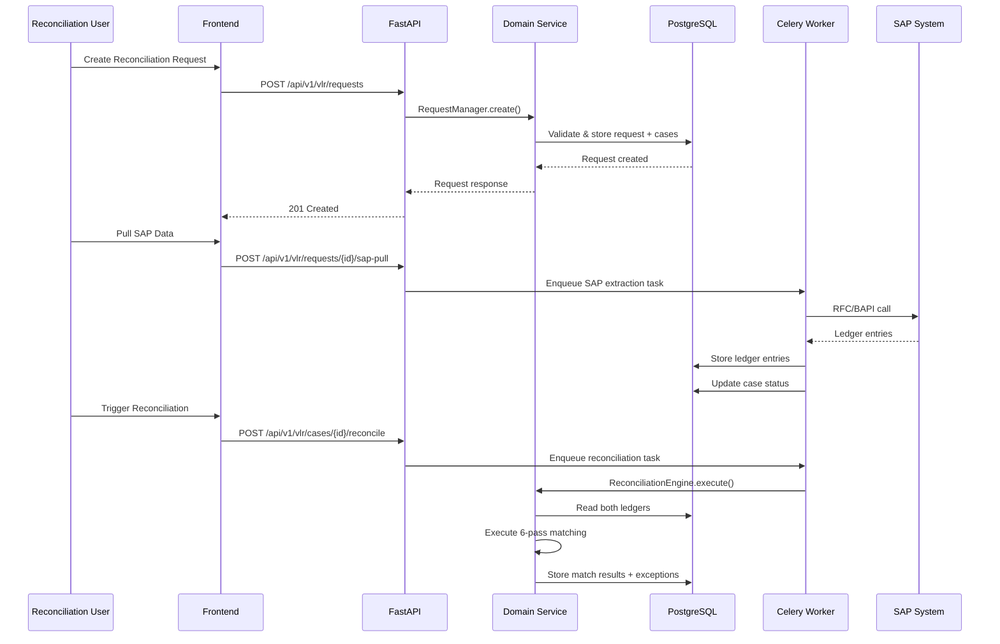
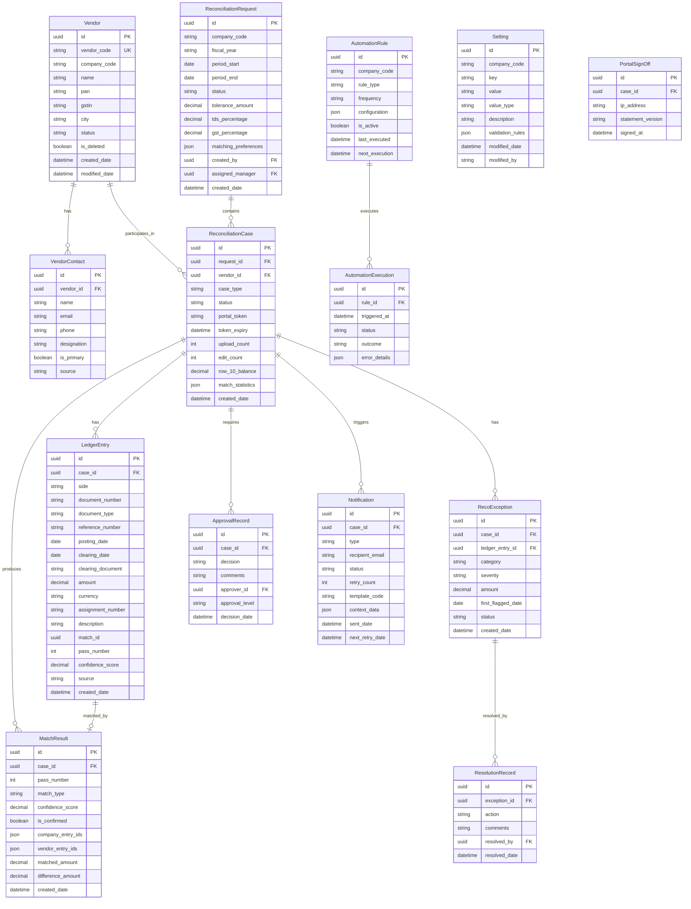
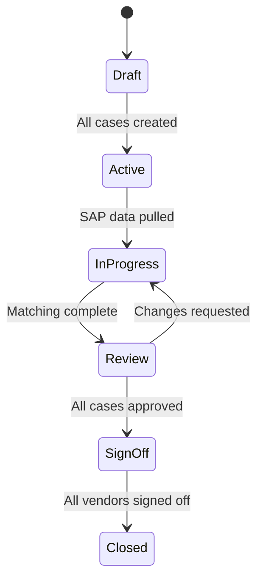
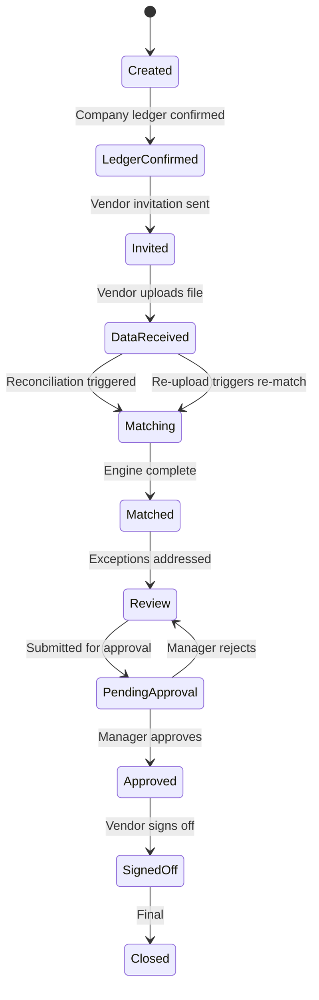

# Design Document: VLR Full Implementation

## Overview

This design transforms the existing static UI prototype of the Vendor Ledger Reconciliation (VLR) system into a fully dynamic, production-ready application. The system automates reconciliation of vendor ledger balances between the company's SAP ERP and vendor-provided statements, covering the entire lifecycle from vendor master management through multi-pass automated matching, exception handling, approval workflows, and MIS reporting.

The implementation leverages the existing enterprise architecture:
- **Backend**: FastAPI (Python 3.12) with Clean Architecture (api/domain/infrastructure layers)
- **Frontend**: React 19 + TypeScript + Vite + PrimeReact (Sakai-compact theme)
- **Database**: PostgreSQL with async SQLAlchemy (asyncpg)
- **Task Queue**: Celery with Redis broker for long-running reconciliation tasks
- **Auth/RBAC**: Existing JWT + Azure AD SSO with permission-based access control
- **Audit**: Existing automatic before/after change tracking via SQLAlchemy event listeners

### Key Design Decisions

| Decision | Rationale |
|----------|-----------|
| Multi-pass reconciliation as Celery tasks | Prevents API blocking for 5K+ entry matching (up to 120s) |
| Token-based vendor portal (no accounts) | Vendors participate without permanent credentials |
| State machine with DB check constraints | Prevents invalid status transitions at database level |
| Soft-delete for vendors and cases | Preserves audit trail while allowing logical removal |
| Company-code scoped queries | Enforces multi-tenant data isolation |
| SAP field mapping as configuration | Allows IT Admin changes without code deployment |
| Idempotency keys for reconciliation triggers | Prevents duplicate engine executions from rapid clicks |


## Architecture

```mermaid
graph TB
    subgraph Frontend["Frontend (React 19 + PrimeReact)"]
        VendorMgmt[Vendor Management]
        RequestStmt[Request Statement]
        DirectReco[Direct Reconciliation]
        TrackReco[Track Reconciliation]
        Reports[Reports & MIS]
        VendorPortal[Vendor Portal]
        Settings[Settings & Config]
    end

    subgraph API["API Layer (FastAPI)"]
        VendorAPI[/api/v1/vlr/vendors]
        RequestAPI[/api/v1/vlr/requests]
        CaseAPI[/api/v1/vlr/cases]
        RecoAPI[/api/v1/vlr/reconciliation]
        ExceptionAPI[/api/v1/vlr/exceptions]
        ApprovalAPI[/api/v1/vlr/approvals]
        ReportAPI[/api/v1/vlr/reports]
        PortalAPI[/api/v1/vlr/portal]
        NotifAPI[/api/v1/vlr/notifications]
        SettingsAPI[/api/v1/vlr/settings]
    end

    subgraph Domain["Domain Layer"]
        VendorSvc[Vendor Service]
        RequestSvc[Request Manager Service]
        RecoEngine[Reconciliation Engine]
        ExceptionSvc[Exception Manager Service]
        ApprovalSvc[Approval Engine Service]
        NotifSvc[Notification Service]
        ReportSvc[Report Service]
    end

    subgraph Infrastructure["Infrastructure Layer"]
        DB[(PostgreSQL)]
        SAP[SAP Connector]
        Email[Email Service]
        Celery[Celery Workers]
        Redis[(Redis Cache)]
        FileStore[File Storage]
    end

    Frontend --> API
    API --> Domain
    Domain --> Infrastructure
    Celery --> RecoEngine
    SAP --> |RFC/BAPI| ExternalSAP[SAP ERP]
    Email --> |SMTP| ExternalEmail[Email Server]
```

### Request Flow Architecture




## Components and Interfaces

### Backend Domain Services

#### VendorService
```python
class VendorService:
    async def create_vendor(self, data: VendorCreateDTO) -> Vendor
    async def update_vendor(self, vendor_id: UUID, data: VendorUpdateDTO) -> Vendor
    async def delete_vendor(self, vendor_id: UUID) -> None  # soft-delete
    async def get_vendor(self, vendor_id: UUID) -> Vendor
    async def list_vendors(self, filters: VendorFilters, pagination: Pagination) -> Page[Vendor]
    async def bulk_import(self, file: UploadFile) -> BulkImportResult
    async def export_vendors(self, filters: VendorFilters, format: ExportFormat) -> bytes
    async def merge_sap_data(self, vendor_code: str, sap_data: SAPVendorData) -> Vendor
```

#### RequestManagerService
```python
class RequestManagerService:
    async def create_request(self, data: RequestCreateDTO) -> ReconciliationRequest
    async def clone_request(self, request_id: UUID, new_period: DateRange) -> ReconciliationRequest
    async def confirm_company_ledger(self, case_id: UUID) -> ReconciliationCase
    async def invite_vendor(self, case_id: UUID) -> None
    async def transition_status(self, request_id: UUID, new_status: RequestStatus) -> None
    async def validate_no_overlap(self, vendor_id: UUID, company_code: str, period: DateRange) -> bool
```

#### ReconciliationEngineService
```python
class ReconciliationEngineService:
    async def execute(self, case_id: UUID) -> ReconciliationResult
    async def execute_pass(self, pass_type: MatchPassType, entries: MatchContext) -> list[MatchResult]
    async def clear_previous_results(self, case_id: UUID) -> None
    async def get_match_statistics(self, case_id: UUID) -> MatchStatistics

    # Individual pass implementations
    def _exact_match(self, company: list[LedgerEntry], vendor: list[LedgerEntry]) -> list[MatchPair]
    def _tolerance_match(self, company: list[LedgerEntry], vendor: list[LedgerEntry], tolerance: Decimal) -> list[MatchPair]
    def _fuzzy_reference_match(self, company: list[LedgerEntry], vendor: list[LedgerEntry], threshold: float) -> list[MatchPair]
    def _one_to_many_match(self, company: list[LedgerEntry], vendor: list[LedgerEntry]) -> list[MatchGroup]
    def _many_to_one_match(self, company: list[LedgerEntry], vendor: list[LedgerEntry]) -> list[MatchGroup]
```

#### ExceptionManagerService
```python
class ExceptionManagerService:
    async def categorize_exceptions(self, case_id: UUID, unmatched: list[LedgerEntry]) -> list[Exception]
    async def resolve_exception(self, exception_id: UUID, action: ResolutionAction, comment: str) -> Exception
    async def bulk_resolve(self, exception_ids: list[UUID], action: ResolutionAction, comment: str) -> list[Exception]
    async def get_edit_count(self, case_id: UUID) -> int
    async def calculate_row_10(self, case_id: UUID) -> Decimal
```

#### ApprovalEngineService
```python
class ApprovalEngineService:
    async def submit_for_approval(self, case_id: UUID) -> ApprovalRecord
    async def approve(self, case_id: UUID, comments: str) -> ApprovalRecord
    async def reject(self, case_id: UUID, comments: str) -> ApprovalRecord
    async def request_changes(self, case_id: UUID, comments: str) -> ApprovalRecord
    async def delegate_authority(self, from_user: UUID, to_user: UUID, duration: timedelta) -> None
    async def check_write_off_threshold(self, case_id: UUID) -> bool
```


#### NotificationService
```python
class NotificationService:
    async def send_invitation(self, case_id: UUID, vendor_contact: VendorContact) -> Notification
    async def send_reminder(self, case_id: UUID) -> Notification
    async def send_approval_notification(self, case_id: UUID, manager_id: UUID) -> Notification
    async def send_rejection_notification(self, case_id: UUID, user_id: UUID, reason: str) -> Notification
    async def schedule_reminders(self, case_id: UUID, intervals: list[int]) -> None
    async def escalate(self, case_id: UUID) -> Notification
    async def get_notification_history(self, case_id: UUID) -> list[Notification]
```

#### SAPConnectorService
```python
class SAPConnectorService:
    async def pull_vendor_master(self, company_code: str) -> list[SAPVendorData]
    async def pull_ledger_entries(self, vendor_code: str, company_code: str, period: DateRange) -> list[SAPLedgerEntry]
    async def test_connection(self) -> ConnectionTestResult
    async def get_health_status(self) -> SAPHealthStatus
    async def incremental_pull(self, vendor_code: str, company_code: str, since: datetime) -> list[SAPLedgerEntry]
```

#### ReportService
```python
class ReportService:
    async def generate_reconciliation_statement(self, case_id: UUID) -> Report
    async def generate_exception_report(self, filters: ExceptionFilters) -> Report
    async def generate_vendor_status_report(self, request_id: UUID) -> Report
    async def generate_monthly_mis(self, period: DateRange, company_code: str) -> Report
    async def export_report(self, report_id: UUID, format: ExportFormat) -> bytes
```

### Frontend Feature Modules

Each VLR feature follows the existing module pattern:

```
frontend/src/features/{feature-name}/
├── api/                # TanStack Query hooks + API calls
│   ├── queries.ts      # useQuery hooks
│   └── mutations.ts    # useMutation hooks
├── components/         # Feature-specific components
├── hooks/              # Custom hooks
├── pages/              # Route-level page components
├── schemas/            # Zod validation schemas
├── types/              # TypeScript interfaces
├── store/              # Redux slice (if client state needed)
└── index.ts            # Public exports
```

#### Key Frontend Modules

| Module | Path | Purpose |
|--------|------|---------|
| Vendor Management | `features/vendor-management/` | Vendor CRUD, bulk import/export, contact management |
| Request Statement | `features/request-statement/` | Multi-step request creation wizard |
| Direct Reconciliation | `features/direct-reconciliation/` | Ad-hoc single-vendor reconciliation |
| Track Reconciliation | `features/track-reconciliation/` | Pipeline dashboard, case details |
| Reports | `features/reports/` | MIS reports, charts, export |
| Notifications | `features/notifications/` | Notification history, preferences |
| Vendor Portal | Separate route tree | Token-authenticated vendor interface |

### API Endpoint Structure

```
/api/v1/vlr/
├── vendors/                          # Vendor CRUD
│   ├── GET    /                       # List with filters
│   ├── POST   /                       # Create vendor
│   ├── GET    /{id}                   # Get vendor detail
│   ├── PUT    /{id}                   # Update vendor
│   ├── DELETE /{id}                   # Soft-delete vendor
│   ├── POST   /bulk-import            # CSV bulk import
│   └── GET    /export                 # Export to CSV/Excel
├── requests/                          # Reconciliation requests
│   ├── GET    /                       # List requests
│   ├── POST   /                       # Create request
│   ├── GET    /{id}                   # Request detail
│   ├── POST   /{id}/clone             # Clone for new period
│   ├── POST   /{id}/sap-pull          # Trigger SAP extraction
│   └── GET    /{id}/statistics        # Request-level stats
├── cases/                             # Reconciliation cases
│   ├── GET    /{id}                   # Case detail
│   ├── POST   /{id}/confirm-ledger    # Confirm company ledger
│   ├── POST   /{id}/invite            # Send vendor invitation
│   ├── POST   /{id}/reconcile         # Trigger matching engine
│   ├── POST   /{id}/submit-approval   # Submit for approval
│   ├── GET    /{id}/statement         # Full reconciliation statement
│   └── GET    /{id}/statistics        # Match statistics
├── exceptions/                        # Exception management
│   ├── GET    /                       # List exceptions (filtered)
│   ├── POST   /{id}/resolve           # Resolve single exception
│   ├── POST   /bulk-resolve           # Bulk resolution
│   └── GET    /categories             # Exception categories
├── approvals/                         # Approval workflow
│   ├── GET    /pending                # My pending approvals
│   ├── POST   /{id}/approve           # Approve case
│   ├── POST   /{id}/reject            # Reject case
│   └── POST   /{id}/delegate          # Delegate authority
├── portal/                            # Vendor portal (token-auth)
│   ├── GET    /auth/{token}           # Authenticate via token
│   ├── POST   /upload                 # Upload ledger file
│   ├── GET    /statement              # View reconciliation
│   └── POST   /sign-off              # Digital sign-off
├── reports/                           # Reports & MIS
│   ├── GET    /reconciliation/{id}    # Reconciliation statement
│   ├── GET    /exceptions             # Exception report
│   ├── GET    /vendor-status          # Vendor tracking report
│   ├── GET    /monthly-mis            # Monthly MIS
│   └── GET    /{id}/export            # Export report
├── notifications/                     # Notification management
│   ├── GET    /history/{case_id}      # Notification history
│   └── POST   /send-reminder          # Manual reminder
└── settings/                          # System configuration
    ├── GET    /                        # All settings
    ├── PUT    /tolerance               # Tolerance config
    ├── PUT    /matching                # Matching preferences
    ├── PUT    /notifications           # Notification intervals
    ├── PUT    /approval-thresholds     # Approval limits
    ├── GET    /sap-connection          # SAP config (masked)
    ├── PUT    /sap-connection          # Update SAP config
    ├── POST   /sap-connection/test     # Test SAP connection
    └── PUT    /field-mapping           # SAP field mapping
```


## Data Models

### Entity Relationship Diagram



### Status State Machines

#### ReconciliationRequest Status


#### ReconciliationCase Status


### Key Enumerations

```python
class RequestStatus(str, Enum):
    DRAFT = "draft"
    ACTIVE = "active"
    IN_PROGRESS = "in_progress"
    REVIEW = "review"
    SIGN_OFF = "sign_off"
    CLOSED = "closed"

class CaseStatus(str, Enum):
    CREATED = "created"
    LEDGER_CONFIRMED = "ledger_confirmed"
    INVITED = "invited"
    DATA_RECEIVED = "data_received"
    MATCHING = "matching"
    MATCHED = "matched"
    REVIEW = "review"
    PENDING_APPROVAL = "pending_approval"
    APPROVED = "approved"
    SIGNED_OFF = "signed_off"
    CLOSED = "closed"

class MatchPassType(int, Enum):
    EXACT = 1
    TOLERANCE = 2
    FUZZY_REFERENCE = 3
    ONE_TO_MANY = 4
    MANY_TO_ONE = 5
    UNMATCHED = 6

class ExceptionSeverity(str, Enum):
    CRITICAL = "critical"
    HIGH = "high"
    MEDIUM = "medium"
    LOW = "low"

class ResolutionAction(str, Enum):
    ACM = "accept_company_match"
    RDV = "request_document_vendor"
    MTD = "mark_tds_difference"
    MAA = "mark_agreed_adjustment"
    WOF = "write_off"
    ESC = "escalate"

class LedgerSide(str, Enum):
    COMPANY = "company"
    VENDOR = "vendor"

class CaseType(str, Enum):
    BATCH = "batch"
    DIRECT = "direct"

class NotificationType(str, Enum):
    INVITATION = "invitation"
    REMINDER = "reminder"
    ESCALATION = "escalation"
    APPROVAL_REQUEST = "approval_request"
    REJECTION = "rejection"
    SIGN_OFF_REQUEST = "sign_off_request"
    SIGN_OFF_COMPLETE = "sign_off_complete"
```


## Correctness Properties

*A property is a characteristic or behavior that should hold true across all valid executions of a system — essentially, a formal statement about what the system should do. Properties serve as the bridge between human-readable specifications and machine-verifiable correctness guarantees.*

### Property 1: SAP Field Mapping Round-Trip

*For any* valid SAP ledger entry record (with fields ZUONR, BELNR, BLART, DMBTR, BUDAT, AUGDT, AUGBL), mapping to the internal schema and then extracting back to SAP field names should produce equivalent values.

**Validates: Requirements 1.3**

### Property 2: CSV Validation Rejects Invalid Structures

*For any* CSV file missing one or more mandatory columns (document_number, amount, posting_date, reference_number), the validation function should reject the file and identify the specific missing columns.

**Validates: Requirements 1.4, 4.4, 17.5**

### Property 3: Duplicate SAP Entry Detection

*For any* set of SAP ledger entries where duplicates exist (same vendor, period, document_number, and amount), the deduplication function should produce a result set containing exactly the unique entries with no duplicates.

**Validates: Requirements 1.7**

### Property 4: Vendor Code Uniqueness Within Company

*For any* two vendor creation attempts with the same vendor_code within the same company_code, the second creation should be rejected regardless of other differing fields.

**Validates: Requirements 2.2**

### Property 5: Inactive Vendor Blocks Request Creation

*For any* vendor with status "Inactive", attempting to include that vendor in a new reconciliation request should result in rejection.

**Validates: Requirements 2.6, 3.9**

### Property 6: Active Case Prevents Vendor Deletion

*For any* vendor that has at least one reconciliation case in a non-closed status, deletion of that vendor should be rejected.

**Validates: Requirements 2.8**

### Property 7: Vendor Search Results Match Filters

*For any* vendor dataset and filter combination (code, name, status, city, PAN), all returned results should satisfy every applied filter criterion.

**Validates: Requirements 2.9**

### Property 8: SAP Merge Preserves Manual Contacts

*For any* vendor with existing manually-added contacts, merging SAP data into the vendor record should preserve all contacts where source is "manual" unchanged.

**Validates: Requirements 2.10**

### Property 9: Period Overlap Detection

*For any* two date ranges [start1, end1] and [start2, end2] for the same vendor within the same company code, the overlap validation should reject creation if and only if the ranges overlap (start1 <= end2 AND start2 <= end1).

**Validates: Requirements 3.3, 15.5, 18.8**

### Property 10: Valid Status Transitions Only

*For any* reconciliation case with a current status, only transitions defined in the state machine should be accepted. All other status transition attempts should be rejected.

**Validates: Requirements 3.7, 15.10**

### Property 11: Request Creates Exactly N Cases

*For any* reconciliation request with N selected vendors (all active), exactly N reconciliation case records should be created, one per vendor.

**Validates: Requirements 3.6**

### Property 12: Closed Case Rejects All Edits

*For any* reconciliation case in "closed" status, any modification attempt (status change, exception resolution, re-matching) should be rejected.

**Validates: Requirements 3.8**

### Property 13: Company Ledger Required Before Invitation

*For any* reconciliation case where the company ledger has not been confirmed, attempting to send a vendor invitation should be rejected.

**Validates: Requirements 3.5**

### Property 14: Upload Count Enforcement

*For any* reconciliation case, the system should accept file uploads up to 5 times and reject the 6th and subsequent upload attempts.

**Validates: Requirements 4.5, 4.6**

### Property 15: Vendor File Upload Round-Trip

*For any* valid vendor ledger file (CSV or Excel) with N entries, uploading and then querying the stored entries for that case should return exactly N entries with matching amounts and reference numbers.

**Validates: Requirements 4.7**

### Property 16: No Entry Matched More Than Once

*For any* set of company and vendor ledger entries after full reconciliation execution, no single entry ID should appear in more than one match result across all passes.

**Validates: Requirements 5.10**

### Property 17: Matched Plus Unmatched Equals Total (Partition Invariant)

*For any* reconciliation case after engine execution, the count of matched entries plus the count of unmatched entries should equal the total number of input entries, for both company and vendor sides.

**Validates: Requirements 5.7**

### Property 18: Exact Match Correctness

*For any* pair of ledger entries (one company, one vendor) with identical amount, posting_date, and reference_number, the exact match pass should produce a match with confidence_score = 1.0.

**Validates: Requirements 5.2**

### Property 19: Tolerance Match Respects Threshold

*For any* pair of ledger entries where |company.amount - vendor.amount| <= tolerance AND reference numbers match, the tolerance pass should match them. For pairs where the difference exceeds tolerance, no match should be produced.

**Validates: Requirements 5.3**

### Property 20: Fuzzy Reference Match Threshold

*For any* pair of ledger entries with equal amounts, if the string similarity score of their reference numbers exceeds 0.8, the fuzzy pass should match them. If similarity is below 0.8, no match should be produced.

**Validates: Requirements 5.4**

### Property 21: Match Statistics Accuracy

*For any* reconciliation case with match results, the reported statistics (match_count, matched_amount, percentage) should exactly equal the aggregation of actual match result records per pass.

**Validates: Requirements 5.12**

### Property 22: Re-Reconciliation Clears Previous Results

*For any* reconciliation case with existing match results, triggering re-reconciliation should first clear all previous match results and exceptions before executing fresh matching passes.

**Validates: Requirements 5.13**

### Property 23: Exception Severity Classification

*For any* unmatched ledger entry, the severity classification should be deterministically derived from the entry's amount and age (days since first flagged) according to the configured thresholds.

**Validates: Requirements 6.1**

### Property 24: Row 10 Calculation Invariant

*For any* reconciliation case, Row_10 should equal (sum of company entries - sum of vendor entries - sum of resolved adjustments). After resolving an exception, the Row_10 should update to reflect the resolution.

**Validates: Requirements 6.5, 7.1**

### Property 25: Manual Edit Limit Enforcement

*For any* reconciliation case, the system should accept up to 10 manual edits and reject the 11th and subsequent edit attempts.

**Validates: Requirements 6.7, 6.8**

### Property 26: Write-Off Threshold Requires Approval

*For any* write-off resolution action where the amount exceeds the configured threshold, the system should require manager approval before applying the action.

**Validates: Requirements 6.10, 7.7**

### Property 27: Approval Submission Requires Zero Row 10

*For any* reconciliation case submitted for approval, the Row_10 balance must equal zero. Cases with non-zero Row_10 should be rejected with the difference amount displayed.

**Validates: Requirements 7.1, 7.2**

### Property 28: Request Closes Only When All Cases Complete

*For any* reconciliation request, the status should transition to "Closed" if and only if all contained cases are in "signed_off" or "closed" status.

**Validates: Requirements 7.10**

### Property 29: Pipeline Count Invariant

*For any* reconciliation request, the sum of cases across all pipeline stages should always equal the total number of cases in the request.

**Validates: Requirements 8.7**

### Property 30: Multi-Tenant Data Isolation

*For any* database query scoped to a company_code, the result set should contain zero records belonging to a different company_code.

**Validates: Requirements 15.9**

### Property 31: Soft-Delete Exclusion From Queries

*For any* soft-deleted vendor or reconciliation record, standard list/search queries should not include the deleted record, but the record should still exist in the database.

**Validates: Requirements 15.4**

### Property 32: Audit Entry Immutability

*For any* existing audit log entry, attempts to update or delete the entry should be rejected by the system.

**Validates: Requirements 12.4**

### Property 33: Audit Entry Atomicity

*For any* domain operation that fails (transaction rollback), no corresponding audit entry should be persisted in the database.

**Validates: Requirements 12.9**

### Property 34: RBAC Endpoint Enforcement

*For any* API endpoint requiring a specific permission and any user lacking that permission, the request should return HTTP 403 with a structured error response.

**Validates: Requirements 11.6, 11.8**

### Property 35: Structured Error Response Format

*For any* API error response (4xx or 5xx), the response body should contain error_code, message, and correlation_id fields. For validation errors (422), field_path should also be present.

**Validates: Requirements 17.1, 17.2, 17.3**

### Property 36: Date Range Validation

*For any* date range input where start_date > end_date OR either date is in the future (for ledger extraction), the validation should reject the input with a descriptive error.

**Validates: Requirements 17.9**

### Property 37: Idempotency Key Prevents Duplicate Execution

*For any* reconciliation trigger request with an idempotency key that has already been processed, the system should return the previous result without executing the engine again.

**Validates: Requirements 17.10**

### Property 38: Notification Retry With Bounded Attempts

*For any* failed email notification, the system should retry up to 3 times with exponential backoff intervals. After 3 failures, the notification should be marked as permanently failed.

**Validates: Requirements 10.9**

### Property 39: Reminder Scheduling at Configured Intervals

*For any* reconciliation case where the vendor has not responded, reminders should be scheduled at exactly the configured day intervals (default: 3, 7, 14 days from invitation).

**Validates: Requirements 10.2**

### Property 40: SAP Credentials Never Exposed

*For any* API response or log entry related to SAP configuration, the credential values (password, API key) should never appear in plaintext.

**Validates: Requirements 20.2**

### Property 41: Setting Validation Against Defined Ranges

*For any* setting update with a value outside the defined valid range, the system should reject the update with a descriptive validation error.

**Validates: Requirements 13.9**

### Property 42: Auto-Match Above Confidence Threshold

*For any* match result with a confidence score above the configured auto-accept threshold, the match should be automatically confirmed without requiring manual review.

**Validates: Requirements 19.3**


## Error Handling

### Error Response Structure

All API errors follow a consistent format:

```json
{
  "error_code": "VLR_CASE_NOT_FOUND",
  "message": "Reconciliation case with ID '...' not found",
  "field_path": null,
  "correlation_id": "corr-abc123-def456",
  "details": {}
}
```

### Error Categories

| HTTP Status | Error Type | Usage |
|-------------|-----------|-------|
| 400 | Bad Request | Malformed request body |
| 401 | Unauthorized | Missing or invalid JWT |
| 403 | Forbidden | Insufficient permissions |
| 404 | Not Found | Entity does not exist |
| 409 | Conflict | Business rule violation, concurrent modification |
| 422 | Validation Error | Pydantic schema validation failure |
| 429 | Too Many Requests | Rate limit exceeded (100 RPM) |
| 500 | Internal Server Error | Unexpected failures (logged, not exposed) |
| 503 | Service Unavailable | SAP or email service down |

### Domain Exception Hierarchy

```python
class VLRDomainException(Exception):
    """Base exception for all VLR business logic errors."""
    error_code: str
    message: str

class VendorNotFoundException(VLRDomainException): ...
class VendorInactiveException(VLRDomainException): ...
class VendorHasActiveCaseException(VLRDomainException): ...
class OverlappingPeriodException(VLRDomainException): ...
class InvalidStatusTransitionException(VLRDomainException): ...
class CaseClosedException(VLRDomainException): ...
class UploadLimitExceededException(VLRDomainException): ...
class EditLimitExceededException(VLRDomainException): ...
class Row10NonZeroException(VLRDomainException): ...
class WriteOffThresholdExceededException(VLRDomainException): ...
class TokenExpiredException(VLRDomainException): ...
class DuplicateVendorCodeException(VLRDomainException): ...
class CompanyLedgerNotConfirmedException(VLRDomainException): ...
class IdempotencyConflictException(VLRDomainException): ...
class ConcurrentModificationException(VLRDomainException): ...
class SAPConnectionException(VLRDomainException): ...
class FileValidationException(VLRDomainException): ...
```

### Retry and Resilience Strategy

| Operation | Retry Strategy | Fallback |
|-----------|---------------|----------|
| SAP data pull | 3 retries with exponential backoff (2s, 4s, 8s) | Queue for manual retry, CSV upload fallback |
| Email delivery | 3 retries with exponential backoff (30s, 120s, 480s) | Mark as failed, show in notification history |
| Reconciliation engine | No retry (idempotent trigger) | User re-triggers manually |
| Database operations | Connection pool retry on transient errors | 503 response |

### Concurrent Modification Handling

- Optimistic locking using `modified_date` version field
- On conflict: return HTTP 409 with `ConcurrentModificationException`
- Frontend shows "Resource modified by another user" with refresh option


## Testing Strategy

### Dual Testing Approach

The VLR system uses both property-based tests and example-based tests for comprehensive coverage.

#### Property-Based Testing (PBT)

**Library**: [Hypothesis](https://hypothesis.readthedocs.io/) for Python backend
**Configuration**: Minimum 100 iterations per property test (default Hypothesis settings profile)
**Tag Format**: `# Feature: vlr-full-implementation, Property {N}: {title}`

PBT is appropriate for the VLR system because:
- The reconciliation engine has pure matching functions with varied input behavior
- Business rules (status transitions, overlap detection, threshold enforcement) are universal properties
- Data validation logic (CSV parsing, field mapping, date ranges) varies meaningfully with input
- The large input space (ledger entries of all shapes) benefits from randomized testing

**Property tests target**:
- Reconciliation engine matching passes (Properties 16-22)
- Business rule enforcement (Properties 4-14, 24-28)
- Data transformation and validation (Properties 1-3, 15, 35-36)
- Security invariants (Properties 30, 32-34, 40)
- Configuration validation (Properties 37, 41-42)

#### Example-Based Unit Tests

**Library**: pytest with pytest-asyncio
**Focus areas**:
- CRUD operation happy paths
- Specific error scenarios (token expiration, connection failures)
- Report generation with known datasets
- Notification routing and template rendering
- Frontend component rendering with specific props

#### Integration Tests

**Library**: pytest + httpx (TestClient)
**Focus areas**:
- Full API request/response cycles with database
- SAP connector with mock SAP server
- Celery task execution for reconciliation engine
- Audit logging atomicity (transaction commit/rollback)
- File upload parsing end-to-end
- RBAC enforcement across all endpoints

#### Frontend Testing

**Libraries**: Vitest + React Testing Library + MSW (Mock Service Worker)
**Focus areas**:
- Component rendering with various data states
- Form validation with Zod schema integration
- TanStack Query hook behavior (loading, error, success states)
- Redux slice state transitions
- Vendor portal token authentication flow

### Test Organization

```
backend/tests/
├── unit/
│   ├── domain/
│   │   ├── test_reconciliation_engine.py     # Properties 16-22
│   │   ├── test_vendor_service.py            # Properties 4-8
│   │   ├── test_request_manager.py           # Properties 9-13
│   │   ├── test_exception_manager.py         # Properties 23-26
│   │   ├── test_approval_engine.py           # Properties 27-28
│   │   └── test_notification_service.py      # Properties 38-39
│   ├── infrastructure/
│   │   ├── test_sap_field_mapping.py         # Property 1
│   │   ├── test_csv_validation.py            # Properties 2, 15
│   │   └── test_settings_validation.py       # Property 41
│   └── api/
│       ├── test_error_responses.py           # Property 35
│       └── test_date_validation.py           # Property 36
├── integration/
│   ├── test_rbac_enforcement.py              # Property 34
│   ├── test_multi_tenant_isolation.py        # Property 30
│   ├── test_audit_immutability.py            # Property 32
│   ├── test_audit_atomicity.py              # Property 33
│   ├── test_soft_delete.py                   # Property 31
│   └── test_idempotency.py                  # Property 37
├── property/
│   ├── test_matching_engine_props.py         # Properties 16-22
│   ├── test_business_rules_props.py          # Properties 4-14, 24-28
│   ├── test_validation_props.py             # Properties 1-3, 35-36
│   └── test_security_props.py               # Properties 30, 32-34, 40
└── conftest.py                               # Shared fixtures

frontend/src/**/*.test.tsx                    # Colocated component tests
frontend/tests/
├── integration/                              # API integration tests with MSW
└── e2e/                                      # Playwright E2E tests (critical flows)
```

### Performance Testing

- Reconciliation engine benchmark: 5,000 entries per side within 120 seconds
- Dashboard load: 1,000 active requests within 3 seconds
- SAP pull: 10,000 entries within 60 seconds
- Concurrent users: 50 simultaneous sessions without degradation
- File upload: 10MB file parsed within 30 seconds

### Test Data Generation (Hypothesis Strategies)

```python
# Example Hypothesis strategies for property tests
from hypothesis import strategies as st

ledger_entry = st.builds(
    LedgerEntry,
    amount=st.decimals(min_value=Decimal("0.01"), max_value=Decimal("99999999.99"), places=2),
    reference_number=st.text(alphabet=st.characters(whitelist_categories=("L", "N")), min_size=1, max_size=20),
    posting_date=st.dates(min_value=date(2020, 1, 1), max_value=date(2025, 12, 31)),
    document_number=st.text(min_size=10, max_size=10, alphabet="0123456789"),
)

date_range = st.builds(
    DateRange,
    start=st.dates(min_value=date(2020, 1, 1), max_value=date(2024, 12, 31)),
    end=st.dates(min_value=date(2020, 1, 1), max_value=date(2025, 12, 31)),
).filter(lambda dr: dr.start <= dr.end)
```
