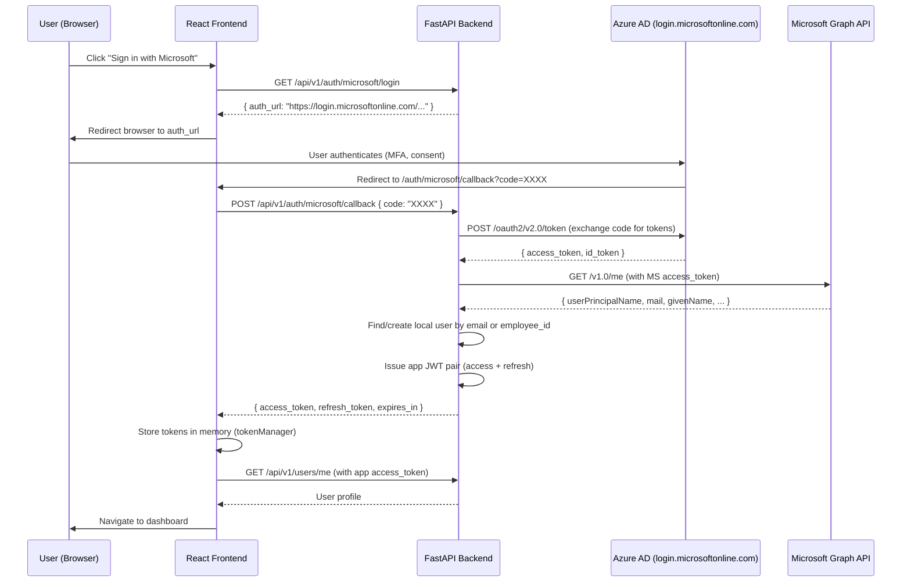

# Microsoft OAuth2 / Azure AD SSO — Implementation Analysis

**Source Project:** `emcatalyst-migration`
**Date:** June 2026
**Status:** Fully implemented (Frontend + Backend)

---

## Executive Summary

The EMCatalyst application implements Microsoft Azure AD Single Sign-On using the **OAuth2 Authorization Code flow** (without PKCE on the backend, using a confidential client with client_secret). The implementation spans both the React frontend and FastAPI backend, with a clean separation of concerns.

---

## Architecture Overview



---

## Technology Stack

| Layer | Technology |
|-------|-----------|
| Identity Provider | Azure Active Directory (Microsoft Entra ID) |
| Protocol | OAuth2 Authorization Code Grant |
| Backend HTTP | `httpx` (async) for Microsoft API calls |
| Token Storage (FE) | In-memory only (never localStorage) |
| Refresh Token | httpOnly secure cookie (SameSite=Lax) |
| App Tokens | HS256 JWT (issued by backend) |

---

## Environment Variables Required

```env
# Azure AD / Microsoft SSO
AZURE_CLIENT_ID=<Application (client) ID from Azure App Registration>
AZURE_CLIENT_SECRET=<Client secret value>
AZURE_TENANT_ID=<Directory (tenant) ID>
AZURE_REDIRECT_URI=http://localhost:5173/auth/microsoft/callback
```

If `AZURE_REDIRECT_URI` is not set, it defaults to `{FRONTEND_URL}/auth/microsoft/callback`.

---

## Backend Implementation

### File: `backend/app/infrastructure/external/azure_sso/azure_client.py`

**Class: `AzureSsoClient`**

Responsibilities:
- Encapsulates all outbound calls to Microsoft identity endpoints
- Builds the OAuth2 authorization URL
- Exchanges authorization code for tokens at Azure's `/token` endpoint
- Fetches user profile from Microsoft Graph API (`/v1.0/me`)

**Key Methods:**

| Method | Purpose |
|--------|---------|
| `is_configured` | Checks if `client_id` and `tenant_id` are set |
| `build_authorization_url()` | Returns `(auth_url, redirect_uri)` tuple |
| `exchange_code_for_profile(code)` | Exchanges code → tokens → Graph profile |

**OAuth Scopes Requested:**
```
openid profile email User.Read
```

**Error Handling:**
- `AzureTokenMissingError` → HTTP 400 (no access_token in response)
- `AzureAuthError` → HTTP 400 (Microsoft returned HTTP error)
- `AzureUnavailableError` → HTTP 502 (Microsoft unreachable)

---

### File: `backend/app/api/v1/routers/auth.py`

**Endpoints:**

#### `GET /api/v1/auth/microsoft/login`

Returns the Azure AD authorization URL. Frontend redirects the browser to this URL.

```json
Response: {
  "success": true,
  "data": {
    "auth_url": "https://login.microsoftonline.com/{tenant}/oauth2/v2.0/authorize?...",
    "redirect_uri": "http://localhost:5173/auth/microsoft/callback"
  }
}
```

Returns 501 if Azure SSO is not configured.

#### `POST /api/v1/auth/microsoft/callback`

Exchanges the authorization code for application JWT tokens.

```json
Request: { "code": "0.AXkA..." }
Response: {
  "success": true,
  "data": {
    "access_token": "eyJ...",
    "refresh_token": "eyJ...",
    "token_type": "Bearer",
    "expires_in": 1800
  }
}
```

**Callback Flow:**
1. Exchange `code` for Microsoft access_token via `AzureSsoClient`
2. Fetch Graph profile (UPN, email, employeeId, name)
3. Look up local user by `employee_id` first, then by `email` (case-insensitive)
4. If user not found → **auto-provision** with `validate_with_ad=True`, random password
5. If user is inactive → HTTP 403
6. Issue app JWT pair via `JwtService.create_token_pair()`
7. Set refresh token as httpOnly cookie
8. Return token response

---

## Frontend Implementation

### File: `frontend/src/features/auth/api/authApi.ts`

```typescript
// Get the Microsoft login URL from backend
export async function getMicrosoftLoginUrl(): Promise<MicrosoftLoginUrlResponse> {
  return api.get<MicrosoftLoginUrlResponse>('/auth/microsoft/login');
}

// Exchange authorization code for app tokens
export async function microsoftCallback(data: MicrosoftCallbackRequest): Promise<TokenResponse> {
  return api.post<TokenResponse>('/auth/microsoft/callback', data);
}
```

### File: `frontend/src/features/auth/components/LoginPage.tsx`

The "Sign in with Microsoft" button:
```typescript
const handleMicrosoftLogin = async (): Promise<void> => {
  try {
    const res = await getMicrosoftLoginUrl();
    window.location.href = res.auth_url; // Full-page redirect to Azure AD
  } catch (err) {
    toast.error('Microsoft login not available');
  }
};
```

### File: `frontend/src/features/auth/components/MicrosoftCallbackPage.tsx`

Handles the redirect back from Azure AD:
1. Extracts `code` from URL query parameters
2. Calls `microsoftCallback({ code })` to exchange for app tokens
3. Stores tokens in memory via `setTokens(access_token, refresh_token)`
4. Fetches user profile via `getMe()`
5. Dispatches `setAuth()` to Redux store
6. Navigates to dashboard

Shows a spinner during processing and an error card if something fails.

---

### File: `frontend/src/features/auth/utils/tokenManager.ts`

**Security Model:**
- Access token: stored in JavaScript variable (never localStorage/sessionStorage)
- Refresh token: stored in memory variable + httpOnly cookie for session persistence
- Proactive refresh: triggers when token expiry - now < 60 seconds
- Concurrent refresh requests are queued (only one refresh runs at a time)
- Session restoration on page reload via `tryRestoreSession()` (uses httpOnly cookie)

---

## Azure App Registration Setup

1. **Azure Portal** → Azure Active Directory → App Registrations → New Registration
2. **Name:** EMCatalyst SSO
3. **Redirect URI:** `https://yourdomain.com/auth/microsoft/callback` (type: Web)
4. **API Permissions:** Add `User.Read` (Microsoft Graph, Delegated)
5. **Certificates & Secrets:** Create a client secret → copy the **Value**
6. **Copy from Overview:**
   - Application (client) ID → `AZURE_CLIENT_ID`
   - Directory (tenant) ID → `AZURE_TENANT_ID`

---

## Security Considerations

| Aspect | Implementation |
|--------|---------------|
| Client Type | Confidential (client_secret on backend, never exposed to frontend) |
| PKCE | Not used (not needed for confidential clients) |
| Token Storage | In-memory only — XSS-safe |
| Refresh Token | httpOnly, Secure, SameSite=Lax cookie |
| User Provisioning | Auto-creates user on first SSO login |
| AD Password | Random 32-char token (user never uses local password) |
| Inactive Users | Blocked with HTTP 403 |
| State Parameter | Not implemented (vulnerability: CSRF on callback) |

### Recommendations for Production

1. **Add `state` parameter** to the authorization URL and validate on callback (prevents CSRF)
2. **Add `nonce`** to validate the `id_token` if using implicit claims
3. **Consider PKCE** even for confidential clients (defense in depth)
4. **Rate-limit** the callback endpoint to prevent brute-force code attempts
5. **Log SSO events** (successful login, failed code exchange, user provisioned)

---

## Route Configuration (Frontend)

```typescript
// In router configuration:
{ path: '/auth/microsoft/callback', element: <MicrosoftCallbackPage /> }
```

This route must be **public** (no auth guard) since the user hasn't authenticated yet when Azure redirects back.

---

## Data Flow Summary

```
Frontend Login Button
    → GET /auth/microsoft/login (backend builds Azure URL)
    → Browser redirects to Azure AD
    → User authenticates with Microsoft
    → Azure redirects to /auth/microsoft/callback?code=XXX
    → Frontend MicrosoftCallbackPage extracts code
    → POST /auth/microsoft/callback { code }
    → Backend exchanges code → MS tokens → Graph profile
    → Backend finds/creates local user
    → Backend issues app JWT pair
    → Frontend stores tokens in memory
    → Frontend fetches user profile
    → Frontend navigates to dashboard
```

---

## Files Reference

| Path | Purpose |
|------|---------|
| `backend/app/infrastructure/external/azure_sso/azure_client.py` | Azure AD HTTP client (build URL, exchange code, fetch profile) |
| `backend/app/infrastructure/external/azure_sso/__init__.py` | Exports AzureSsoClient and error classes |
| `backend/app/api/v1/routers/auth.py` | `/microsoft/login` and `/microsoft/callback` endpoints |
| `backend/app/core/config.py` | `AZURE_CLIENT_ID`, `AZURE_CLIENT_SECRET`, `AZURE_TENANT_ID`, `AZURE_REDIRECT_URI` |
| `frontend/src/features/auth/api/authApi.ts` | `getMicrosoftLoginUrl()`, `microsoftCallback()` |
| `frontend/src/features/auth/components/LoginPage.tsx` | "Sign in with Microsoft" button handler |
| `frontend/src/features/auth/components/MicrosoftCallbackPage.tsx` | OAuth callback page (code exchange) |
| `frontend/src/features/auth/utils/tokenManager.ts` | In-memory token storage + proactive refresh |
| `frontend/src/shared/api/apiClient.ts` | Axios with 401 refresh interceptor |
